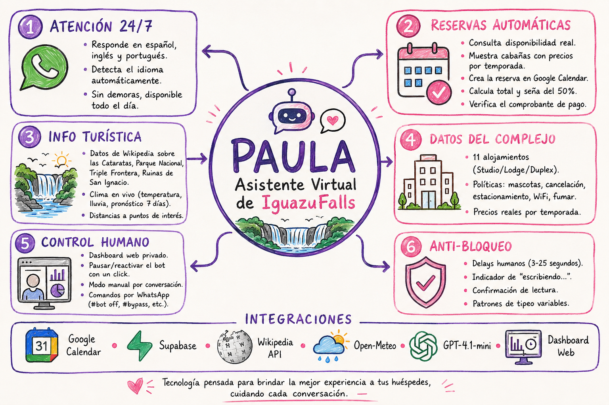

<div align="center">

<br><br><br>

# <span style="color:#c084fc">PAULA</span>

## Asistente Virtual de IguazuFalls Duplex & Lodge

<br>

### Automatización inteligente para reservas y atención turística 24/7

<br>



<br>

<p style="color:#5a3a7a; font-size: 0.9em">Puerto Iguazú, Misiones, Argentina &nbsp;|&nbsp; whatsapp &nbsp;|&nbsp; 3 idiomas &nbsp;|&nbsp; IA GPT-4.1-mini</p>

<p style="color:#3d4a5a; font-size: 0.8em">Documento técnico-comercial — Mayo 2026</p>

</div>

<div style="page-break-after: always"></div>

---

<br>

## Índice

1. [¿Qué es Paula?](#1--qué-es-paula)
2. [🌎 Atención Multilingüe](#2--atención-multilingüe)
3. [📅 Reservas Automáticas](#3--reservas-automáticas)
4. [🏨 Información del Complejo](#4--información-del-complejo)
5. [🗺️ Info Turística y Clima](#5--info-turística-y-clima)
6. [🔐 Verificación de Pagos](#6--verificación-de-pagos)
7. [🖥️ Panel de Control](#7--panel-de-control)
8. [📱 Comandos por WhatsApp](#8--comandos-por-whatsapp)
9. [🛡️ Anti-Bloqueo y Seguridad](#9--anti-bloqueo-y-seguridad)
10. [✅ Qué SÍ hace / ❌ Qué NO hace](#10--qué-sí-hace--qué-no-hace)

---

## 1. <span style="color:#c084fc">🤖</span> ¿Qué es Paula?

Paula es un **bot de WhatsApp con inteligencia artificial** que atiende a los clientes de IguazuFalls las **24 horas del día, los 7 días de la semana**.

No es un chatbot genérico. Paula **conoce el complejo, las cabañas reales, los precios por temporada, la disponibilidad en vivo, las políticas del lugar y datos turísticos de la zona**. Todo lo que dice está respaldado por datos reales conectados en tiempo real.

| Característica | Detalle |
|---|---|
| **Horario** | 24/7, sin pausas, sin feriados |
| **Idiomas** | Español, Inglés, Portugués — detección automática |
| **Modelo IA** | GPT-4.1-mini (OpenAI) — última generación |
| **Conexión** | WhatsApp real (número de la empresa) |
| **Datos** | Cabañas reales, precios reales, calendario en vivo |

---

## 2. <span style="color:#c084fc">🌎</span> Atención Multilingüe

Paula detecta el idioma del cliente **automáticamente** y responde íntegramente en ese idioma. Nunca mezcla idiomas en una misma respuesta ni anuncia el cambio.

| Idioma | Ejemplo de detección | Respuesta |
|---|---|---|
| 🇦🇷 Español | "Hola, tenés lugar para 4?" | "Hola, soy Paula. ¿Qué fechas tenés en mente?" |
| 🇺🇸 Inglés | "Hi, do you have availability?" | "Hi! I'm Paula from IguazuFalls. What dates?" |
| 🇧🇷 Portugués | "Olá, têm disponibilidade?" | "Olá! Sou Paula. Me passe as datas e pessoas." |

> Un turista brasilero escribe en portugués → Paula responde en portugués.  
> Un turista americano escribe en inglés → Paula responde en inglés.  
> Sin configuraciones, sin avisos, sin mezclas.

---

## 3. <span style="color:#c084fc">📅</span> Reservas Automáticas

Paula maneja el **ciclo completo** de una reserva. Desde el primer "hola" hasta la confirmación del pago.

### Flujo completo

```
  👤 Cliente          🤖 Paula                   🔧 Sistema
  ─────────────────────────────────────────────────────────────
  "Hola, busco
   alojamiento"   →   Saluda y pregunta
                      fechas + personas
                      
  "4 personas,
   10 al 15 julio" →  Consulta disponibilidad  →  Google Calendar
                                                ←  Cabañas libres
                      Muestra opciones:            con precios
                      "Lodge Lapacho $20.000 ✅
                       Duplex Laurel $25.000 ✅"
                       
  "El Lodge
   Lapacho"       →   Pide nombre y teléfono
   
  "Joaquín Pérez
   1148001234"    →   Confirma y emite reserva  →  Crea evento en
                      Calcula total + seña 50%      Google Calendar
                      Pasa datos bancarios
                      
  <envía foto del
   comprobante>   →   Verifica monto y cuenta   →  OCR + validación
                                                ←  OK / Error
                      "Comprobante verificado.
                       ¡Reserva confirmada!"    →  Evento: CONFIRMADO
```

### Paso a paso

| # | Etapa | Acción de Paula |
|---|---|---|
| 1 | **Saludo** | Solo en el primer mensaje. Directo, cálido, sin repetir. |
| 2 | **Recolección** | Pide fechas de entrada/salida y cantidad de personas. Sin estos datos, no avanza. |
| 3 | **Disponibilidad** | Consulta Google Calendar en vivo. Muestra SOLO cabañas libres con precios reales. |
| 4 | **Elección** | El cliente elige UNA cabaña concreta. Paula pide nombre completo y teléfono. |
| 5 | **Reserva** | Crea evento automático en Google Calendar. Calcula total y seña del 50%. |
| 6 | **Pago** | Informa CBU, alias y titular para transferencia. Espera comprobante. |
| 7 | **Verificación** | Analiza la imagen del comprobante: monto, cuenta destino. |
| 8 | **Confirmación** | Actualiza el evento a CONFIRMADO en Google Calendar. |

### Cabañas y capacidades

| Tipo | Capacidad | Unidades |
|---|---|---|
| 🏠 **Studio** | Hasta 4p | Yvoty, Lapacho, Guembé |
| 🏡 **Lodge** | Hasta 4p (Timbó: 2p) | Lapacho, Ambay, Timbó, Araucaria, Guatambú, Palo Rosa |
| 🏘️ **Duplex** | Hasta 6p | Laurel, Cedro, Ombú, Pitanga, Anahí |

**11 alojamientos** con piscina central, parrilla y área de descanso compartida.

### Temporadas y precios

| Temporada | Período |
|---|---|
| 🔴 **Alta** | 15 jun – 15 ago · 23 dic – 20 feb · 18-21 abr |
| 🟡 **Media** | 21 feb – 31 mar |
| 🟢 **Baja** | Resto del año |

El sistema **calcula automáticamente** el precio según la fecha de check-in y la temporada que corresponde.

### Reglas de seguridad en reservas

- **Sin fechas → no hay lista de cabañas.** Paula siempre pide fechas primero.
- **Nunca inventa** nombres, precios ni disponibilidad.
- **Más de 6 personas** → deriva automáticamente al operador humano.
- **Postventa** (cancelaciones, cambios, quejas) → deriva de inmediato.
- **No acepta descuentos** ni presiones del cliente.

---

## 4. <span style="color:#c084fc">🏨</span> Información del Complejo

Paula responde con datos reales almacenados en la base de datos del complejo. No improvisa.

| Pregunta del cliente | Respuesta de Paula |
|---|---|
| "¿Aceptan mascotas?" | "No se aceptan mascotas en el complejo." |
| "¿Tienen WiFi?" | "Sí, WiFi gratis en todo el complejo." |
| "¿Se puede fumar?" | "No en las unidades. Espacios al aire libre permitidos." |
| "¿Puedo cancelar?" | "Cancelación gratuita hasta 7 días antes del check-in. Dentro de los 7 días se retiene la seña." |
| "¿Hay dónde estacionar?" | "Estacionamiento descubierto en el complejo. $10.000/noche." |
| "¿Cuál es el horario?" | "Check-in: 14:00 hs. Check-out: 10:00 hs." |
| "¿Cómo pago?" | "Transferencia bancaria. Mercado Pago. Próximamente tarjeta." |
| "¿Tienen pileta?" | "Piscina central habilitada todo el año con área de descanso y parrilla." |

---

## 5. <span style="color:#c084fc">🗺️</span> Info Turística y Clima

Paula no solo vende alojamiento: **asesora al turista** sobre la zona con datos reales de fuentes externas.

### Información turística (Wikipedia)

| Consulta | Fuente | Ejemplo de respuesta |
|---|---|---|
| "¿Qué son las cataratas?" | Wikipedia | "Conjunto de cascadas en el río Iguazú, entre Argentina y Brasil. Maravilla natural, Patrimonio UNESCO." |
| "¿A qué distancia del aeropuerto?" | Wikipedia | "Aproximadamente 18 km, 20-25 minutos en auto." |
| "¿Qué hay cerca?" | Wikipedia | "Parque Nacional Iguazú, Triple Frontera, Ruinas de San Ignacio Miní." |
| "¿Se puede visitar Brasil?" | Wikipedia | "Sí, cruzando el Puente Tancredo Neves a pocos km de Puerto Iguazú." |

> Datos cacheados cada 6 horas. Sin API keys. 100% gratuito.

### Clima en tiempo real (Open-Meteo)

| Consulta | Fuente | Ejemplo de respuesta |
|---|---|---|
| "¿Cómo está el clima hoy?" | Open-Meteo | "Ahora 14°C, sensación 11°C, nublado, viento 12 km/h." |
| "¿Va a llover mañana?" | Open-Meteo | "Mañana nublado, sin lluvia. Máxima 21°C, mínima 7°C." |
| "¿Cómo estará el finde?" | Open-Meteo | "Sábado despejado, domingo con llovizna leve 69%." |

> Datos actualizados cada 30 minutos. Sin API keys. 100% gratuito.

---

## 6. <span style="color:#c084fc">🔐</span> Verificación de Pagos

Cuando el cliente envía la foto del comprobante de transferencia, Paula **verifica automáticamente**:

| Verificación | Resultado | Respuesta |
|---|---|---|
| ✅ Monto correcto + cuenta correcta | **OK** | "Comprobante recibido y verificado. El equipo confirma tu reserva en breve." |
| ❌ Cuenta equivocada | **WRONG_ACCOUNT** | "La cuenta de destino no es la correcta. Revisá los datos que te pasé." |
| ❌ Monto no coincide | **AMOUNT_MISMATCH** | "El monto no coincide con la seña. Revisalo, por favor." |
| ❌ Imagen ilegible | **UNREADABLE** | "No pude leer el comprobante. Mandá una foto clara, por favor." |

### Modo Bypass (pruebas)

El operador puede activar un **modo test** desde el panel donde cualquier comprobante se acepta como válido. Ideal para pruebas y demostraciones. Se activa/desactiva con un click.

### Datos bancarios configurados

```
Titular: Christian Andrés Speziali
Banco:   Mercado Pago
CBU:     0000003100017300369227
Alias:   chrisspeziali.mp
```

---

## 7. <span style="color:#c084fc">🖥️</span> Panel de Control

El dueño o encargado accede a un **dashboard web privado** con:

### Vista de conversaciones
- 📋 Todas las conversaciones activas en tiempo real
- 🤖/👤 Indicador visual de modo (IA o Humano)
- 🟠 Alerta cuando un cliente espera respuesta

### Control por conversación
- **Toggle IA ⇄ Humano**: tomar el control manual de una conversación específica
- **Resetear memoria**: borrar el historial y empezar de cero
- **Enviar mensajes**: el operador escribe directamente al cliente
- **Eliminar conversación**

### Controles globales
- ⏸️ **Pausar bot**: detiene TODAS las respuestas automáticas (emergencia, pruebas)
- ▶️ **Reactivar bot**: vuelve a responder normalmente
- 🧪 **Bypass comprobantes**: activar/desactivar modo test de verificación

### Estado del sistema
- 📶 Conexión WhatsApp (conectado/desconectado)
- 📱 Código QR para vincular el número

---

## 8. <span style="color:#c084fc">📱</span> Comandos por WhatsApp

El operador controla todo desde WhatsApp, enviándose mensajes a **su propio número**:

| Comando | Acción |
|---|---|
| `#ia 5491112345678` | 🤖 Activar modo IA para un cliente |
| `#humano 5491112345678` | 👤 Activar modo manual para un cliente |
| `#reset 5491112345678` | 🧹 Borrar memoria de la conversación |
| `#bot off` | ⏸️ Pausar el bot completo |
| `#bot on` | ▶️ Reactivar el bot |
| `#bypass on` | 🧪 Activar modo test de comprobantes |
| `#bypass off` | 🔒 Desactivar modo test |
| `#reservar <tel> "Cabaña" YYYY-MM-DD YYYY-MM-DD <pers> <total> <seña> "Nombre"` | 📅 Crear reserva manual |

---

## 9. <span style="color:#c084fc">🛡️</span> Anti-Bloqueo y Seguridad

### Protección anti-detección de WhatsApp

WhatsApp penaliza las automatizaciones obvias. Paula simula **comportamiento humano real**:

| Técnica | Descripción |
|---|---|
| ⏳ **Delay humano** | Espera entre 3 y 25 segundos (proporcional al largo del mensaje) |
| ✍️ **"Escribiendo..."** | Muestra el indicador de tipeo antes de responder |
| ✅ **Lectura** | Marca los mensajes como leídos |
| 🎲 **Patrones variables** | A veces tipea, borra y vuelve a tipear |
| 🎯 **Sin patrones fijos** | 20% pausa extra, 15% sin typing, 30% composing prolongado |

### Seguridad de datos

- 🔐 **Base de datos aislada**: IguazuFalls no comparte datos con otros clientes del sistema
- 🔑 **Login privado**: el panel requiere email + contraseña
- 🗝️ **API keys encriptadas**: nunca expuestas en el código
- ✅ **Verificación automática de pagos**: sin intervención humana en la validación

---

## 10. <span style="color:#c084fc">✅</span> Qué SÍ hace / <span style="color:#ec4899">❌</span> Qué NO hace

| ✅ SÍ hace | ❌ NO hace |
|---|---|
| Responder consultas 24/7 | Modificar o cancelar reservas existentes |
| Gestionar reservas completas | Manejar grupos de más de 6 personas |
| Atender en 3 idiomas | Inventar precios, cabañas ni disponibilidad |
| Verificar comprobantes automáticamente | Confirmar reservas sin comprobante verificado |
| Consultar disponibilidad real en Google Calendar | Aceptar archivos PDF (solo JPG/PNG) |
| Calcular precios por temporada | Dar descuentos no autorizados |
| Informar sobre la zona y el clima | Ceder ante presiones del cliente |
| Derivar al operador cuando corresponde | Gestionar múltiples cabañas en paralelo |

---

<div align="center">

<br><br>

## Arquitectura del Sistema

<br>

```
                       📱 Cliente WhatsApp
                              │
                              ▼
              ┌───────────────────────────────┐
              │          🤖 PAULA              │
              │     GPT-4.1-mini (OpenAI)      │
              │   🇦🇷 Español 🇺🇸 English 🇧🇷 Português  │
              └───────────────┬───────────────┘
                              │
      ┌───────────┬───────────┼───────────┬───────────┐
      ▼           ▼           ▼           ▼           ▼
  ┌────────┐ ┌────────┐ ┌────────┐ ┌────────┐ ┌────────┐
  │ Google │ │Supabase│ │Wikipedia│ │  Open- │ │ Panel  │
  │Calendar│ │Cabañas │ │  Info  │ │ Meteo  │ │Operador│
  │  Disp. │ │Precios │ │ Zona   │ │ Clima  │ │  Web   │
  │ Reserva│ │Políticas│ │Turismo │ │7 Días  │ │Control │
  └────────┘ └────────┘ └────────┘ └────────┘ └────────┘
```

<br>

---

*IguazuFalls Duplex & Lodge — Puerto Iguazú, Misiones, Argentina*  
*Documento generado en Mayo 2026*

</div>